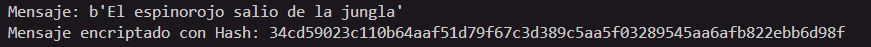
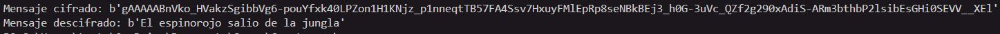
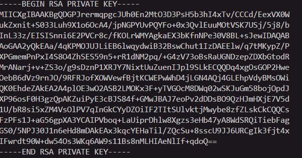
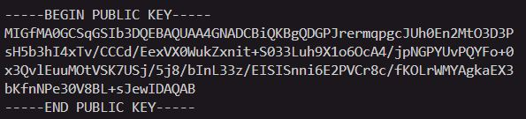

# Ejemplos de Cifrado y Hashing en Python

Este repositorio contiene tres ejemplos básicos en Python que demuestran el uso de diferentes técnicas de seguridad: hashing, cifrado simétrico y cifrado asimétrico.

---

## Requisitos

Para ejecutar estos códigos, asegúrate de tener Python 3 instalado y las siguientes bibliotecas:

- **hashlib** (incluida por defecto en Python)
- **cryptography** (instálala con `pip install cryptography`)

---

## Ejemplo 1: Hashing con `hashlib`

Este ejemplo utiliza el algoritmo SHA-256 para generar un hash de un mensaje.

```python
import hashlib

# Mensaje a encriptar
message = b"El espinorojo salió de la jungla"

# Generar hash con SHA-256
hashObject = hashlib.sha256(message)
hashDigest = hashObject.hexdigest()

print(f"Mensaje encriptado con Hash: {hashDigest}")
```
### Salida esperada
Un hash único en formato hexadecimal para el mensaje proporcionado.



## Ejemplo 2: Cifrado Simétrico con `cryptography.fernet`

En este ejemplo, se utiliza el cifrado simétrico Fernet para proteger y recuperar un mensaje.

```python
from cryptography.fernet import Fernet

# Generar una clave
key = Fernet.generate_key()
cipher_suite = Fernet(key)

# Texto a cifrar
Mensaje = b"El espinorojo salió de la jungla"

# Cifrar el texto
mensajeCipher = cipher_suite.encrypt(Mensaje)
print(f"Mensaje cifrado: {mensajeCipher}")

# Descifrar el texto
mensajeDeCipher = cipher_suite.decrypt(mensajeCipher)
print(f"Mensaje descifrado: {mensajeDeCipher}")
```
### Salida esperada
- **Mensaje cifrado:** Texto cifrado ilegible.
- **Mensaje decifrado:** El mensaje original.



## Ejemplo 3: Cifrado Asimétrico con `cryptography.hazmat`
Este ejemplo utiliza el algoritmo RSA para generar un par de claves (privada y pública) y realizar operaciones de cifrado y descifrado.

```python
from cryptography.hazmat.primitives.asymmetric import rsa, padding
from cryptography.hazmat.primitives import serialization, hashes

# Generar par de claves
llavePrivada = rsa.generate_private_key(
    public_exponent=65537,
    key_size=1024,
)

llavePublica = llavePrivada.public_key()

# Serializar las claves
private_pem = llavePrivada.private_bytes(
    encoding=serialization.Encoding.PEM,
    format=serialization.PrivateFormat.TraditionalOpenSSL,
    encryption_algorithm=serialization.NoEncryption()
)

public_pem = llavePublica.public_bytes(
    encoding=serialization.Encoding.PEM,
    format=serialization.PublicFormat.SubjectPublicKeyInfo
)

# Mostrar las claves
print(private_pem.decode('utf-8'))
print(public_pem.decode('utf-8'))

# Texto a cifrar
mensaje = b"El espinorojo salió de la jungla"

# Cifrar el mensaje con la clave pública
textoCifrado = llavePublica.encrypt(
    mensaje,
    padding.OAEP(
        mgf=padding.MGF1(algorithm=hashes.SHA256()),
        algorithm=hashes.SHA256(),
        label=None
    )
)
print(f"Mensaje cifrado: {textoCifrado}")

# Descifrar el mensaje con la clave privada
textoDecifrado = llavePrivada.decrypt(
    textoCifrado,
    padding.OAEP(
        mgf=padding.MGF1(algorithm=hashes.SHA256()),
        algorithm=hashes.SHA256(),
        label=None
    )
)
print(f"Mensaje descifrado: {textoDecifrado}")
```
### Salida esperada 
- **Claves:** La clave privada y pública generadas en formato PEM.


- **Mensaje cifrado:** Texto cifrado ilegible.
- **Mensaje descifrado:** El mensaje original.


## Notas Importantes
- **Hashing:** Es un proceso unidireccional, ideal para verificar integridad o almacenar contraseñas.
- **Cifrado Simétrico:** La misma clave cifra y descifra los datos, por lo que es esencial mantenerla segura.
- **Cifrado Asimétrico:** Utiliza un par de claves (pública y privada) para mejorar la seguridad, pero es más lento que el cifrado simétrico.